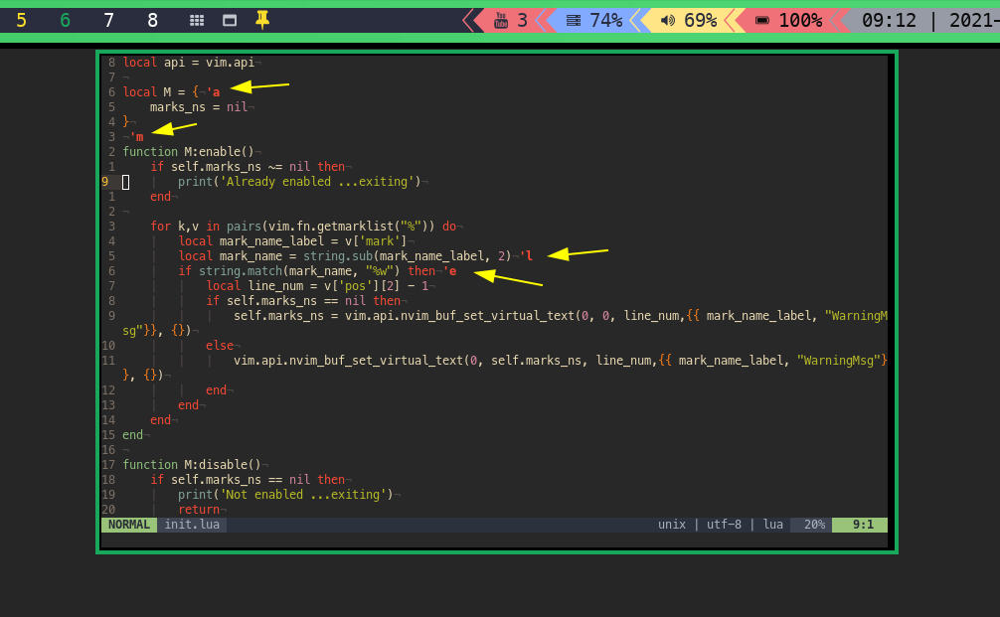

# visualmark-nvim

This plugin shows where marks are stored visually in buffer using **virtual_text**.



## EXPLANATION

This isnt plugin that you will use often, but sometimes I tend to forget what mark name I put on line i see
and with quick toggle bind you can see it's name.
This is mostly my experiment with current state of lua api in nvim (and to celebrate it!), more usefull ones will follow!

## INSTALLATION

Install using any plugin manager
```
Plug 'nagy135/visualmark-nvim'
```

## USAGE

Provides 3 binds:

Toggle:
```
<leader>mm
```

Enable:
```
<leader>me
```

Disable:
```
<leader>md
```

## CONFIGURATION

As of now, you can only rebind default bindings like this
```
nnoremap <leader>mm :lua require('visualmark-nvim'):toggle()<cr>
```
